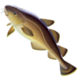

# qb-fishy
Remake of the old Swedish Paradise fishing script, but for QB!

## Dependencies

- qb-core (for item definitions and notifications)
- qb-inventory (for giving of items)

# Installation

1. Unpack a release to your `resources` folder, or appropriate `[subfolder]` to taste.
2. Copy the images from `fishimg/` into your `qb-inventory/html/images/` folder.
3. Add `ensure qb-fishy` to your server configuration.
4. Either restart the server, or do the commands `refresh` and `ensure qb-fishy` yourself.
5. Configure a way for your users to get the `fishingrod`. (Sell it at a store, or whatever)
6. Configure a way for your users to sell the fish items `fish_small`, `fish_large`, and `fish_gigantic`. (Buy them at the store, or whatever)
7. Enjoy to the extent possible.

## Recommendations

* Keep the fishing rod very cheap.
    * It's a good, *legal* way for new characters to make money, so it makes little sense to gatekeep it.
    * Fishing is a very social activity, and excluding new players from social situations is a bad idea.
* Keep the rewards for selling fish low.
    * Catching fish is relatively easy.
    * Making it harder serves no real purpose, other than to frustrate beginners.
    * Catching lots of fish is fun!
    * Making too much money too quickly spoils the economy, for sure.
    * It's better to start out way too low, and increase as needed. Buffs are more popular than nerfs.

# Configuration

There is only one configuration option:  Turn off Sport Fishing Zones.

By default, you can fish only in designated Sport Fishing Zones. There is one at the Del Perro Pier, one in Galilee, and one in Chumash.

To allow fishing anywhere where there is sufficient water, which is pretty much anywhere there is ocean, add `set FishyAnywhere true` to your server configuration.
To change this *while the server is running*, use the `/fishy` command, as detailed below.

## /fishy command

The `/fishy` command is restricted using [basic CFX Aces](https://forum.cfx.re/t/basic-aces-principals-overview-guide/90917).

The syntax is `/fishy [anywhere|zones|toggle]`

 Argument  | What it does 
-----------|--------------
 (nothing) | Report the current state (i.e 'Fishing is restricted to zones')
 anywhere  | Set fishing to be allowed anywhere with sufficient water
 zones     | Set fishing to be restricted to Sport Fishing Zones
 toggle    | Flip so that if it was restricted, it is now allowed anywhere, or vice versa
 
# The Fish Images

There is already a fishing rod image that ships with `qb-inventory`, so I just re-used that.  
For the fish, I wanted them to look distinct from each other, so I've supplied images for those.

Yes, I realize the edges are a little scuffed.

# Using the resource

Of course, this resource was not created just to sit there in a server and wait.  
The whole point is for the players to *go fishing!*

## Obtaining a fishing rod

Either by `/giveitem`, or set up one of the shops to sell it.  
The item name is `fishingrod`

`qb-fishy` *does not* provide a way to purchase a rod, so you'll have to set that up in whatever resource handles your shops.

## Begin fishing

The recommended way is to put the fishing rod in one of the hotbar slots, and then pressing the relevant hotkey.  
To start fishing, you must "Use" your fishing rod **while looking at water**. It's not enough to be near water.

## Stop fishing

Press the hotkey again, or open the inventory to "Use" the rod again, or press any of the directional movement keys (i.e W, A, S, or D)
